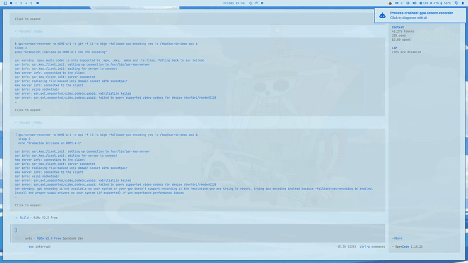

# Matrix Screensaver for Omarchy

A Matrix-themed screensaver/lock screen plugin for Omarchy (Wayland compositor) featuring Matrix rain, white rabbit image, typewriter text, and terminal-style password input.

## Demo



## Features

- **Matrix Rain Effect**: Animated green characters falling like in The Matrix
- **White Rabbit**: Fades in after the typewriter text
- **Typewriter Text**: "Knock, knock...", "Wake up...", "Follow the white rabbit." with blinking cursor
- **Terminal-style Password Input**: Monospace font with `> ` prompt
- **Multi-monitor Support**: Primary screen shows full animation, secondary screens show only rain

## Installation

1. Clone this repository
2. Copy the folder to `~/.config/omarchy/plugins/`
3. Rename to `akuma.matrix-screensaver`
4. Restart Quickshell: `killall quickshell`

## Usage

Lock the screen with:
```bash
omarchy system lock
```

## Animation Sequence

1. Matrix rain appears
2. User clicks or presses a key
3. Rain fades out (1.5 seconds)
4. Typewriter text appears with blinking cursor
5. White rabbit fades in
6. Password input box appears

## Configuration

Edit `TypewriterText.qml` to change:
- `lines`: Array of phrases to display
- `charDelay`: Typing speed (default: 60ms)
- `humanVariance`: Random variation in typing (default: 40ms)
- `linePause`: Pause between lines (default: 1200ms)

## Files

- `Service.qml`: Main service, IPC handler, lock/unlock logic
- `MatrixLockView.qml`: Main lock view with animation sequence
- `MatrixRain.qml`: Matrix rain effect
- `TypewriterText.qml`: Typewriter text effect
- `MatrixPasswordInput.qml`: Terminal-style password input
- `assets/WhiteRabbit.png`: White rabbit image

## License

MIT
